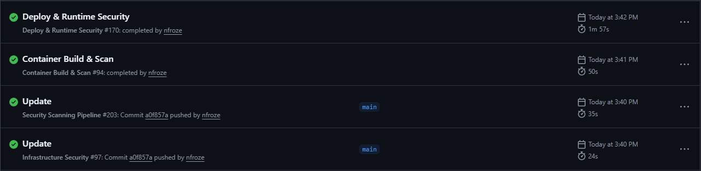
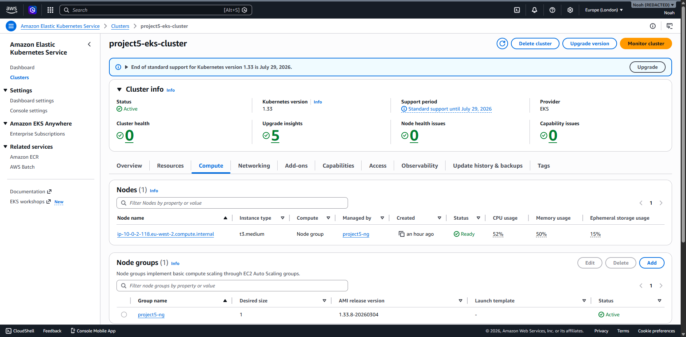
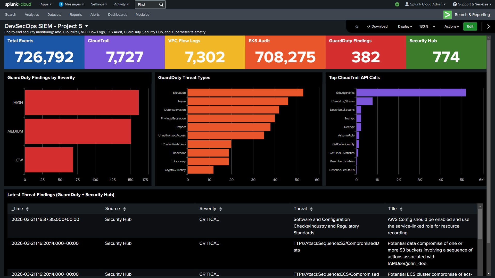

# End-to-End DevSecOps Pipeline with SIEM Integration

A production-grade DevSecOps implementation demonstrating security automation across the entire software delivery lifecycle—from commit to runtime monitoring—with threat detection events streamed to Splunk SIEM.

## Overview

Organisations adopting Kubernetes often struggle to implement security consistently across the CI/CD pipeline. This project addresses that challenge by building a complete DevSecOps pipeline that automates security scanning at every phase: static analysis and secret detection during CI, container vulnerability scanning before deployment, infrastructure-as-code validation for Terraform, dynamic application security testing post-deployment, and continuous runtime threat detection with GuardDuty.

The pipeline deploys a Node.js application to Amazon EKS, with infrastructure provisioned entirely through Terraform modules. Security findings from GuardDuty and EKS audit logs flow through Lambda functions into Splunk Cloud, providing centralised visibility for security operations. The Kubernetes deployment implements defence-in-depth with non-root containers, read-only filesystems, dropped capabilities, and seccomp profiles.

This demonstrates how a DevSecOps engineer thinks about security holistically—not as a gate at the end of development, but as automated guardrails embedded throughout delivery.

## Architecture

The system follows a four-stage pipeline architecture triggered on push to main:

1. **Security Scanning (CI)**: Semgrep performs SAST, Trivy scans dependencies, and Gitleaks detects secrets. A security gate blocks progression if critical issues are found.

2. **Container Build & Scan**: Multi-stage Docker build creates a hardened image (non-root user, dumb-init for signal handling). Trivy scans the container before pushing to Docker Hub.

3. **Infrastructure & Deployment (CD)**: Checkov validates Terraform against CIS benchmarks. The application deploys to EKS with security-hardened pod specs. OWASP ZAP runs DAST against the live endpoint.

4. **Runtime Monitoring**: GuardDuty findings and EKS CloudWatch logs stream via Lambda to Splunk Cloud, enabling security operations visibility and incident response.

The Terraform modules provision a VPC with public/private subnet separation, NAT gateway for egress, EKS cluster with KMS-encrypted secrets, and the complete Lambda-to-Splunk integration.

## Tech Stack

**Infrastructure**: AWS EKS, Terraform, VPC, KMS, DynamoDB (state locking)

**CI/CD**: GitHub Actions (4 workflow chain), Docker Hub

**Security Scanning**: Semgrep (SAST), Trivy (SCA/Container), Gitleaks (secrets), Checkov (IaC), OWASP ZAP (DAST)

**Monitoring & SIEM**: AWS GuardDuty, CloudWatch, Lambda, Splunk Cloud

**Application**: Node.js, Express, Kubernetes

## Key Decisions

- **Chained GitHub Actions workflows**: Each pipeline stage runs as a separate workflow, triggered on successful completion of the previous. This provides clear separation of concerns and allows infrastructure scans to run independently of application code changes.

- **Lambda-based SIEM integration over native connectors**: GuardDuty and CloudWatch events route through custom Lambda functions to Splunk HEC rather than using AWS's native Splunk integration. This provides transformation flexibility and works with Splunk Cloud without requiring AWS-side Firehose configuration.

- **Security-hardened Kubernetes manifests**: Pods run as non-root (UID 10001), with read-only root filesystem, all capabilities dropped, and seccomp profiles enforced. These controls exceed many production deployments and demonstrate understanding of container security beyond defaults.

- **Documented security exceptions**: Rather than ignoring Checkov findings, the project includes a SECURITY_EXCEPTIONS.md explaining each accepted risk and what would change in a production environment—demonstrating mature security thinking over checkbox compliance.

## Screenshots

## Author

**Noah Frost**

- Website: [noahfrost.co.uk](https://noahfrost.co.uk)
- GitHub: [github.com/nfroze](https://github.com/nfroze)
- LinkedIn: [linkedin.com/in/nfroze](https://linkedin.com/in/nfroze)