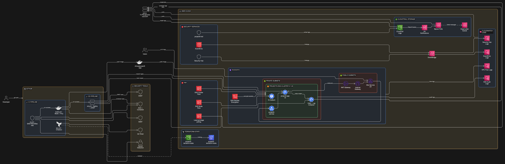
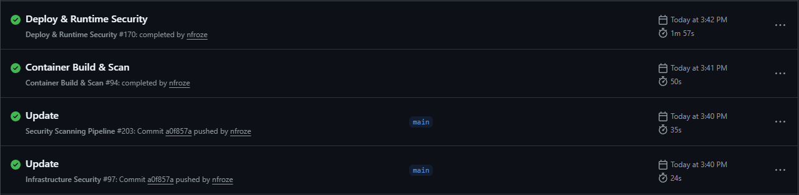
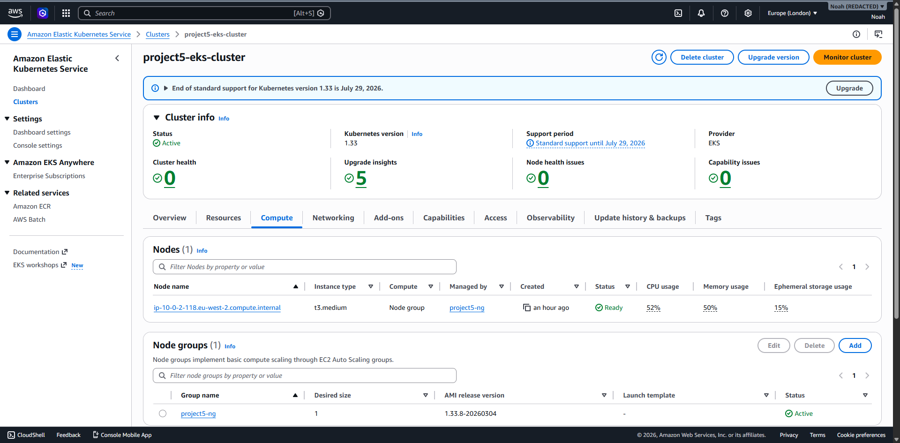
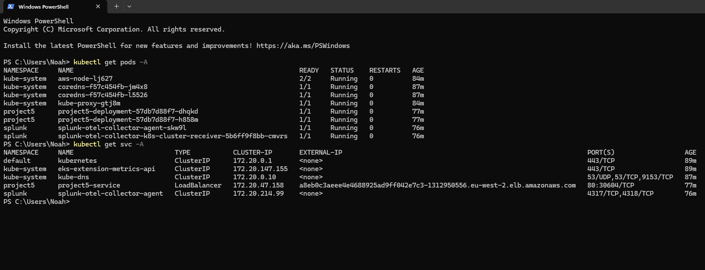
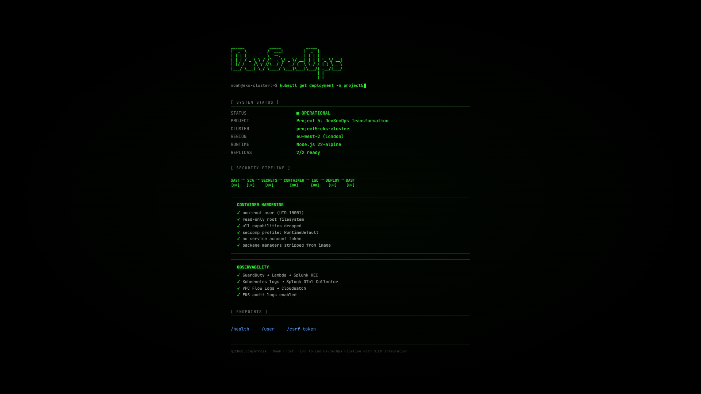
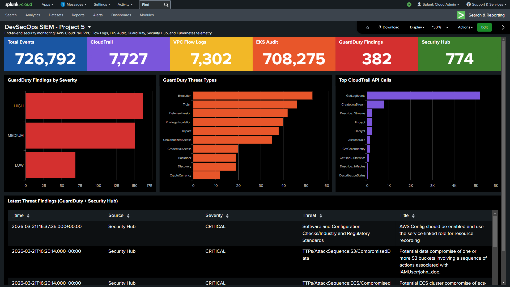

# End to End DevSecOps Transformation

A production-grade DevSecOps pipeline that embeds security scanning at every stage — from code commit through to runtime monitoring — deployed on AWS EKS with centralised SIEM visibility in Splunk Cloud.

## Overview

Organisations adopting DevOps often bolt security on as an afterthought, creating friction between development speed and compliance requirements. This project demonstrates how to weave security into every phase of the software delivery lifecycle so that vulnerabilities are caught early, infrastructure is validated before deployment, and runtime threats are surfaced in real time.

The system chains four GitHub Actions workflows into a gated pipeline: static analysis (Semgrep), dependency scanning (Trivy), and secret detection (Gitleaks) must pass before a container is built, scanned, pushed to Docker Hub, and deployed to an EKS cluster. Post-deployment, OWASP ZAP runs dynamic analysis against the live application. In parallel, a separate workflow validates Terraform against CIS benchmarks using Checkov.

For runtime visibility, five AWS security data sources — GuardDuty, Security Hub, CloudTrail, VPC Flow Logs, and EKS Audit Logs — feed into Splunk Cloud via the Splunk Add-on for AWS (pull model), while Kubernetes container logs stream through an OpenTelemetry Collector (push model via HEC). The result is a single pane of glass covering application behaviour, infrastructure events, and threat detection.

## Architecture

The pipeline flows left to right: a push to `main` triggers the CI workflow, which gates the container build, which gates deployment. Terraform changes trigger IaC scanning independently. Within AWS, the EKS cluster runs in private subnets behind a NAT Gateway, with a LoadBalancer Service exposing the application through public subnets. Security telemetry follows two paths into Splunk — GuardDuty and Security Hub route through EventBridge into CloudWatch Logs (polled by the Splunk Add-on), while CloudTrail logs land in S3 with SNS/SQS notifications enabling Splunk to pull new objects. The OTel Collector, deployed via Helm, pushes container stdout/stderr and Kubernetes events directly to Splunk's HEC endpoint.

## Tech Stack

**Infrastructure**: AWS VPC, EKS (v1.33), KMS, NAT Gateway, Terraform with S3/DynamoDB state backend

**CI/CD**: GitHub Actions (4 chained workflows), Docker multi-stage builds, Helm

**Security Scanning**: Semgrep (SAST), Trivy (SCA + container), Gitleaks (secrets), Checkov (IaC), OWASP ZAP (DAST)

**Monitoring & SIEM**: Splunk Cloud, Splunk Add-on for AWS, OpenTelemetry Collector, CloudWatch Logs, EventBridge

**Threat Detection**: GuardDuty, Security Hub (AWS Foundational Best Practices), CloudTrail, VPC Flow Logs, EKS Audit Logs

**Application**: Node.js 22 (Alpine), Express with CSRF protection, hardened container (non-root, read-only filesystem, all capabilities dropped)

## Key Decisions

- **Dual Splunk ingestion model (pull + push)**: AWS-native security data uses the Splunk Add-on for AWS pull model because it avoids managing Firehose delivery streams and Lambda functions. Kubernetes container logs use the OTel Collector push model because pod logs aren't available through AWS APIs. This hybrid approach keeps infrastructure simple while ensuring full coverage.

- **Gated workflow chain over monolithic pipeline**: Splitting CI/CD into three sequential workflows (`ci.yml → build.yml → cd.yml`) means a failed security scan stops the pipeline before a container is ever built, saving compute time and ensuring no unscanned image reaches the registry.

- **CloudTrail via S3/SNS/SQS rather than CloudWatch**: CloudTrail logs are high-volume. Routing them through S3 with SQS-based polling gives Splunk durable, cost-effective access without CloudWatch Logs ingestion charges, and the SQS dead-letter queue handles transient failures.

- **Hardened container defaults**: The Dockerfile removes npm/corepack at build time, runs as UID 10001, and the Kubernetes security context enforces read-only root filesystem with all capabilities dropped. These aren't aspirational — they're enforced in both the image and the deployment manifest.

## Screenshots

## Author

**Noah Frost**

- Website: [noahfrost.co.uk](https://noahfrost.co.uk)
- GitHub: [github.com/nfroze](https://github.com/nfroze)
- LinkedIn: [linkedin.com/in/nfroze](https://linkedin.com/in/nfroze)
